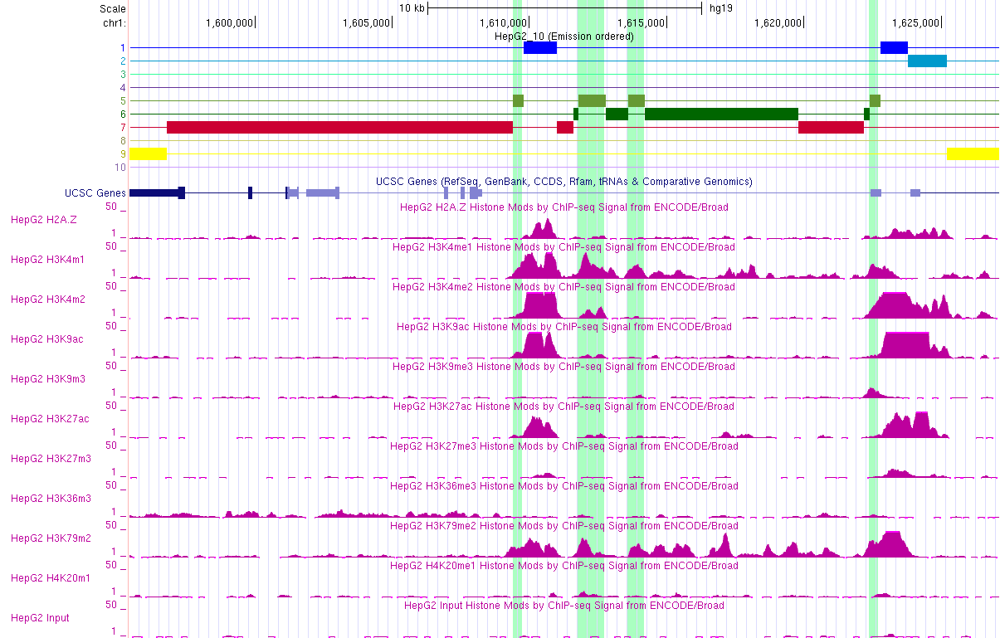

# hse_hw3_chromhmm
[Ссылка на colab](https://colab.research.google.com/drive/15umUh2vXqvAk3fWwrGRBwJZNNDFFmy-f?usp=sharing)
# Часть 1

Клеточная линия, рассматриваемая в Дз2 (IMR-90), не содержит ChIP-seq эксперименты в рассматриваемых гистоновых метках

Поэтому для этого дз будет рассматриваться HepG2.

## Список гистоновых меток

| Гистоновая метка | Ссылка |
|------------------|--------|
|   H2AFZ          |    http://hgdownload.cse.ucsc.edu/goldenPath/hg19/encodeDCC/wgEncodeBroadHistone/wgEncodeBroadHistoneHepg2H2azStdAlnRep1.bam    |
|   H3K4me1        |    http://hgdownload.cse.ucsc.edu/goldenPath/hg19/encodeDCC/wgEncodeBroadHistone/wgEncodeBroadHistoneHepg2H3k04me1StdAlnRep1.bam    |
|   H3K9me3        |    http://hgdownload.cse.ucsc.edu/goldenPath/hg19/encodeDCC/wgEncodeBroadHistone/wgEncodeBroadHistoneHepg2H3k09me3AlnRep1.bam    |
|   H3K4me2        |    http://hgdownload.cse.ucsc.edu/goldenPath/hg19/encodeDCC/wgEncodeBroadHistone/wgEncodeBroadHistoneHepg2H3k4me2StdAlnRep1.bam    |
|   H3K9ac         |    http://hgdownload.cse.ucsc.edu/goldenPath/hg19/encodeDCC/wgEncodeBroadHistone/wgEncodeBroadHistoneHepg2H3k9acStdAlnRep1.bam    |
|   H3K27ac        |    http://hgdownload.cse.ucsc.edu/goldenPath/hg19/encodeDCC/wgEncodeBroadHistone/wgEncodeBroadHistoneHepg2H3k27acStdAlnRep1.bam    |
|   H3K36me3       |    http://hgdownload.cse.ucsc.edu/goldenPath/hg19/encodeDCC/wgEncodeBroadHistone/wgEncodeBroadHistoneHepg2H3k36me3StdAlnRep1.bam    |
|   H3K79me2       |    http://hgdownload.cse.ucsc.edu/goldenPath/hg19/encodeDCC/wgEncodeBroadHistone/wgEncodeBroadHistoneHepg2H3k79me2StdAlnRep1.bam    |
|   H4K20me1       |    http://hgdownload.cse.ucsc.edu/goldenPath/hg19/encodeDCC/wgEncodeBroadHistone/wgEncodeBroadHistoneHepg2H4k20me1StdAlnRep1.bam    |
|   H3K27me3       |    http://hgdownload.cse.ucsc.edu/goldenPath/hg19/encodeDCC/wgEncodeBroadHistone/wgEncodeBroadHistoneHepg2H3k27me3StdAlnRep1.bam    |

## cellmarkfiletable.txt

[Файл](./cellmarkfiletable.txt)

## ChromHMM
[Папка с выдачей](./ChromHMM/)

| |  |
|------------------|--------|
|       |     |
|          |     |
| ||

## Эпигетические типы

| Состояние | Эпигенетический тип |Встречаемость в гистоновых модификациях| Описание | Изображение из USCC |
|-----------|----------|------|----------|---------------------|
|     1     |  Insulator  |  во всех, но чаще всего: <ul><li> H3K4me1 <li> H3K4me2 <li> H3K4me3 <li> H3K9ac <li> H3K27ac <li> H3K79me2  |  Чаще всего ассоциировано с <ul><li> RefSeqExon <li> RefSeqGene <li> RefSeqTES <li> RefSeqTSS2kb </li> </li>  В меньшей степени с: <li> CpGIslands |                      |
|     2     |  Insulator  |   почти не встречается, кроме: <li> H3K9ac  <li> H3K27ac |   Чаще всего ассоциировано с <ul><li> CpGIslands <li> RefSeqExon <li> RefSeqTES <li> RefSeqTSS <li> RefSeqTSS2kb   |           |
|     3     |  Weak transcribed |  во всех, но чаще всего: <ul><li> H2AFZ <li> H3K4me1 <li> H3K4me2 <li> H3K4me3 <li> H3K9ac <li> H3K27ac <li> H3K79me2    |  Чаще всего ассоциировано с  <li> RefSeqTES <li> RefSeqTSS2kb   |                      |
|     4     |  Inactive/poised Promoter |   Встречается почти во всех, но чаще всего:  <li> H3K4me1  |  Чаще всего ассоциировано с  <li> RefSeqTES <li> LaminB1lads   |                      |
|     5     |  Transcribed |   Во всех, но чаще всего:  <li> H3K4me1 <li> H3K4me2 <li> H3K27ac <li> H3K79me2 <li> H4K20me1|  Чаще всего ассоциировано с <li> RefSeqGene <li> RefSeqTES  |                      |
|     6     |  Transcribed  |   Во всех, но чаще: <li> H3K4me1 <li> H3K79me2 <li> H4K20me1  | Чаще всего ассоциировано с <ul><li> RefSeqExon <li> RefSeqGene <li> RefSeqTSS |                      |
|     7     |  Active Promoter |  Встречается во всех   |  <li> Слабый сигнал <li> Чаще всего ассоциировано с <ul><li> RefSeqExon <li> RefSeqGene <li> RefSeqTSS  |                      |
|     8     |  Strong enhancer |   Редко встрчается, наиболее часто у: <li> H3K9me3 <li> H3K27me3  |  Чаще всего ассоциировано с LaminB1lads    |                      |
|     9     |  Weak/poised enhancer |   Почти не встречается   |  Чаще всего ассоциировано с  <li> Genome <li> LaminB1lads    |                      |
|    10     |  Inactive/poised Promoter  |   Почти не встречается, кроме: <li> H3K27me3  |  Чаще всего ассоциировано с  <li> RefSeqTES <li> LaminB1lads    |                      |

 ### Пример:
   
#  Часть 2
   
# Код
  ### Создание файла cellmarkfiletable.txt
  ```
  import os
arr = list()

path = '/content/'
control = 'ControlRep1.bam'
cell_type = 'HepG2'

with open(f'{path}cellmarkfiletable.txt', 'a') as the_file:
  for file in os.listdir(path):
    if file[-3:]=='bam' and not file.startswith('Control'):
      s = f'{cell_type}\t{file.split(".")[0]}\t{file}\t{control}\n'
      the_file.write(s)
  ```
 ###  Binarize Bam
```
  !java -mx5000M -jar /content/ChromHMM/ChromHMM.jar BinarizeBam -b 200  /content/ChromHMM/CHROMSIZES/hg19.txt /content/ cellmarkfiletable.txt   binarizedData
  ```
  ### Learn Module
  ```
  !java -mx5000M -jar /content/ChromHMM/ChromHMM.jar LearnModel  -b 200 /content/binarizedData/ /content/learnData 10 hg19
  ```
  ### Для части 2
  ```
types = ['Insulator', 'Insulator', 'Weak_transcribed', 'Inactive/poised_Promoter', 'Transcribed', 'Transcribed', 'Active_Promoter', 'Strong_enhancer',
         'Weak/poised_enhancer', 'Inactive/poised_Promoter']

with open(f'/content/learnData/HepG2_10_dense.bed', 'r') as f:
  with open(f'/content/learnData/HepG2_10_dense_new.bed', 'a') as f_new:
    lines = f.readlines()
    flag = True
    for line in lines:
      if flag:
        flag = False
        f_new.write(line)
      else:
        arr = line.split('\t')
        arr[3] = arr[3]+'_'+types[int(arr[3])-1]
        f_new.write('\t'.join(arr))
  ```
